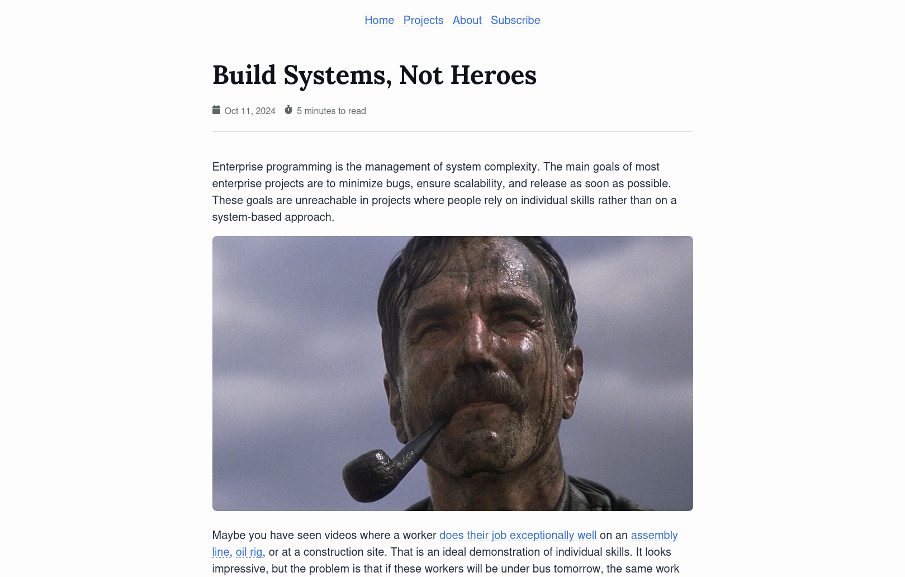
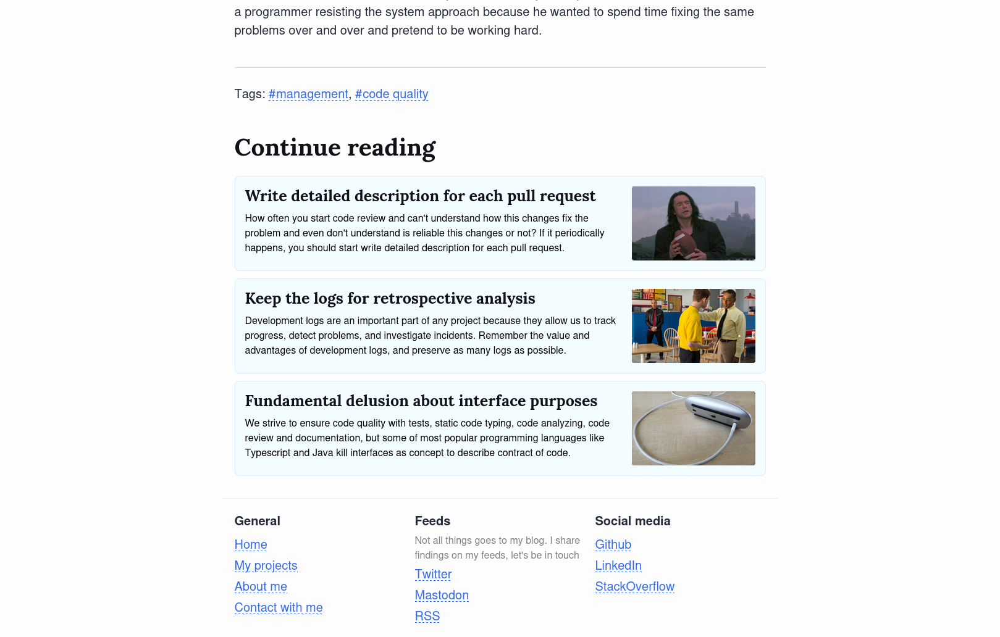
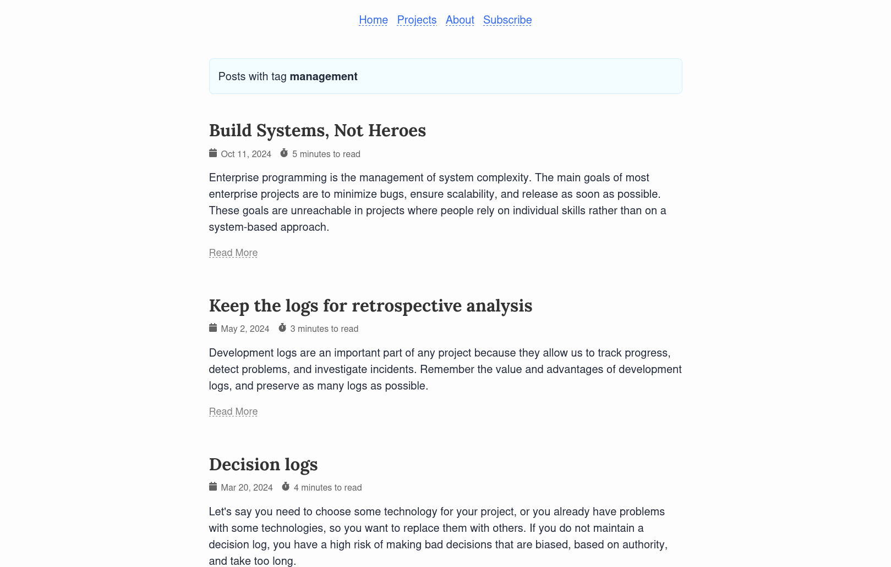
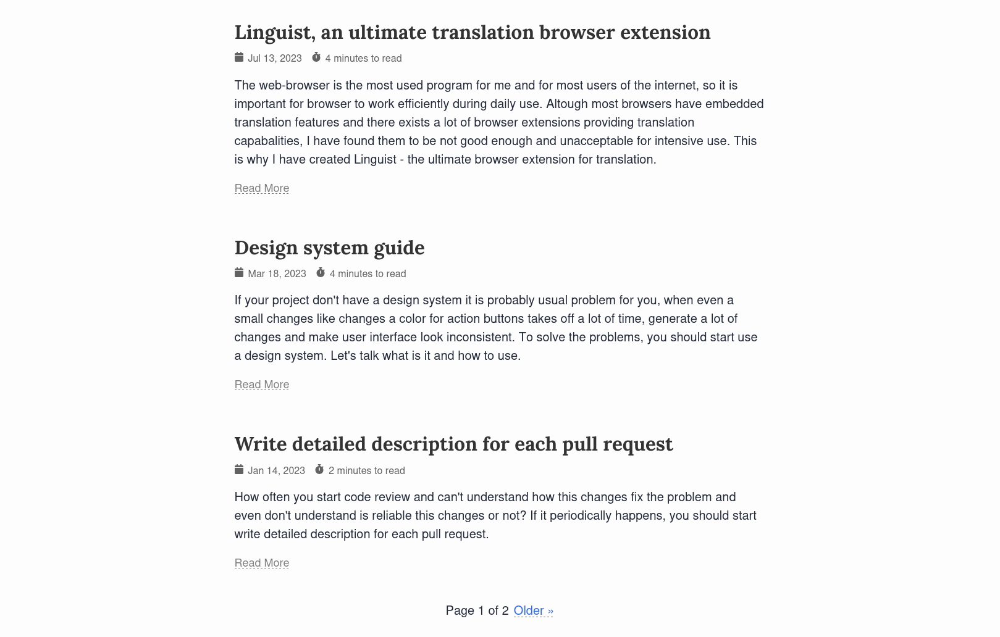
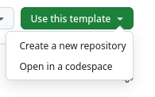
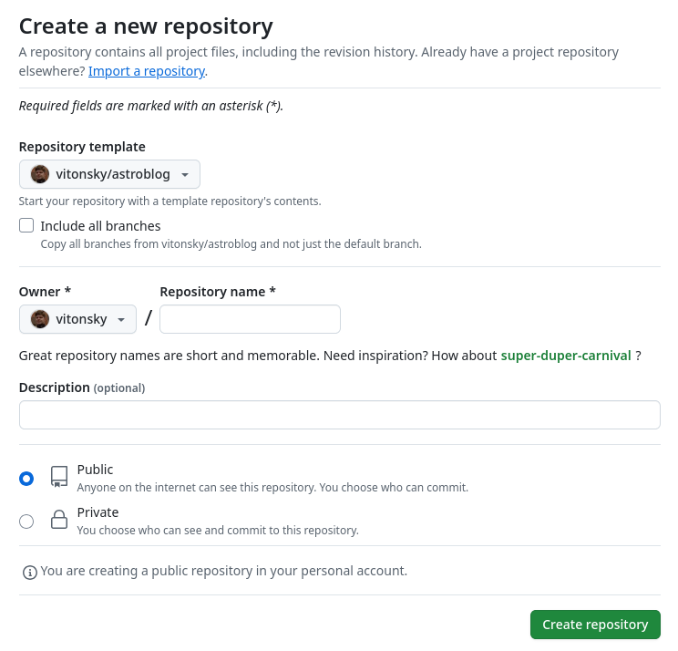

Template for blog, based on [Astro framework](https://astro.build/).

Key features is

- Simple and clear design focused on content
- Blog posts is a modular `.mdx` files with Markdown syntax
- Custom pages can be added as `.mdx` files
- Flexible site customization with couple files
- Accessible web components built with [ARIA Practices](https://www.w3.org/WAI/ARIA/apg/)
- Fully responsive on desktops, tablets, and smartphones
- SEO Friendly
- Excellent Lighthouse/PageSpeed scores

Batteries included - RSS Feed, Site Map, Syntax Highlighting, Tagging System, Pagination and other basic features you expect from nice blog platform.

# Preview

You may check live example at https://vitonsky.net

# How to start

To start use this blog, just create new GitHub repository and select current repository as template.

You may self-host your blog for free, just setup domain for your github repository, update config in `astro` directory with provide your domain and that's all.

Every time you add new posts or pages, GitHub CI will rebuild and deploy your blog.

# Files Structure

## Posts

Directory `posts` contains `.mdx` files with content of your blog posts.

To add a new post just run `npm run post`, this command will create new file with current data.

## Custom pages

You can add new pages as `.mdx` files in directory `astro/pages`.

For example file `astro/pages/about.mdx` will add page `/about` on your site.

Custom pages is purposed to add custom content that looks different of blog posts.

## Site config

Directory `astro` contains site data.

To customize your blog, update this files

- `astro/consts.ts` file defines meta information of your site like domain and description
- `astro/links.ts` file defines links in header and footer of your site
- `astro/pages` directory contains `.mdx` files that describes custom pages on your site
- `astro/public` directory contains files that will be publicly available on your site

## Favicon

You may generate favicon from svg file. To do it, place your svg icon as `astro/assets/logo.svg` file and then run `npm run build:favicon`.

This command will convert yous SVG icon to favicon that is have a wide browsers support.

## License

[MIT](./LICENSE)
